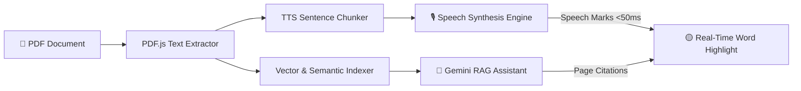
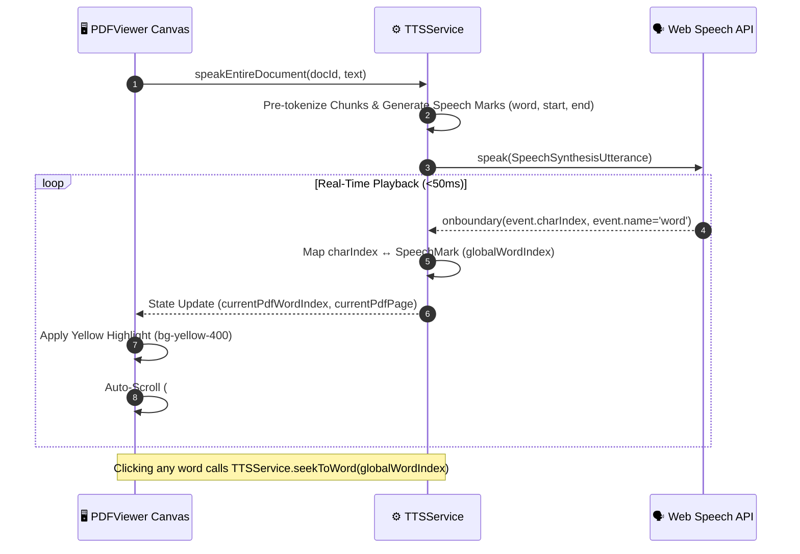

# 📄 PDF Reader AI — Smart Document Assistant & Audio Player

<div align="center">


**An intelligent, privacy-first PDF reader combining Google Gemini AI chat, in-browser vector search, and a studio-grade Text-to-Speech (TTS) audiobook engine with real-time word-by-word visual synchronization.**

[🚀 Quick Start](#-quick-start) • [✨ Key Features](#-key-features) • [🧠 Architecture](#-architecture) • [🎙️ Speech Synchronization](#️-real-time-word-synchronization) • [⌨️ Keyboard Shortcuts](#️-keyboard-shortcuts) • [♿ Accessibility](#-wcag-22-aa-accessibility)

</div>

---

## 🌟 Overview

**PDF Reader AI** transforms static documents into dynamic, conversational, and audible experiences. Upload any PDF to instantly query its contents with Gemini AI, jump directly to source citations, or sit back and listen with native speech marks that highlight every spoken word in real time.



---

## ✨ Key Features

### 🎙️ Real-Time Audio Narration & Speech Synchronization
- **Word-Level Highlighting**: Live yellow cursor (`bg-yellow-400 text-slate-950`) tracks the narration word-by-word with sub-50ms latency.
- **Native Speech Marks**: Synchronized using browser `SpeechSynthesis` word boundary events paired with tokenized speech marks.
- **Auto-Scrolling Viewport**: Automatically scrolls the reading pane just enough to keep the currently spoken word centered and visible.
- **Multi-Page Page Turning**: Automatically transitions pages when narration moves into the next page without stutter or pause.
- **Interactive Click-to-Seek**: Click any word anywhere in the document to instantly jump audio playback to that exact word.
- **State Persistence**: Full sync preserved across **Play**, **Pause**, **Resume**, **Forward/Rewind (10s)**, and slider seeking.

### 🤖 Gemini AI Document Assistant
- **RAG & Semantic Retrieval**: In-browser vector search matches questions against document embeddings with cosine similarity.
- **Interactive Source Citations**: Clicking any citation `[p. X]` jumps directly to the target page and highlights the referenced passage.
- **AI Quick Actions**: One-click Executive Summary, Key Insights, Chapter Breakdown, and Study Quiz generation.
- **Audio Answers**: Click "Read Aloud" on any AI response to hear the answer while words highlight in real time.

### 📑 Dual Reading Engine
- **Interactive Mode**: Tokenized document sheet with clickable sentences, words, and scalable typography.
- **Raw PDF Mode**: Native PDF iframe viewer with zoom controls (60% to 200%), page selector, and text search.
- **Indic/Devanagari Normalization**: Specialized pre-processing to ensure Hindi, Marathi, and Sanskrit conjuncts render seamlessly.

### 🎛️ Narration Studio & Floating Player
- **Voice Customization**: Select from all local and natural browser voices with real-time preview.
- **Speed & Pitch Control**: Adjustable speed (0.75x to 2.0x) and pitch controls.
- **Draggable Floating Widget**: Pop out the player to keep controls accessible while scrolling or chatting.

---

## 🎙️ Real-Time Word Synchronization

How word-level audio synchronization works under the hood:



---

## 🚀 Quick Start

<details open>
<summary><b>Installation & Running Locally</b></summary>

### Prerequisites
- **Node.js**: v18.17+ or v20+
- **npm**: v9+

### 1. Clone the repository
```bash
git clone https://github.com/your-username/pdf-reader-ai.git
cd pdf-reader-ai
```

### 2. Install dependencies
```bash
npm install
```

### 3. Configure environment variables
Create a `.env.local` file in the root directory:
```env
# Google Gemini API Key (Get from https://aistudio.google.com/app/apikey)
GEMINI_API_KEY=your_gemini_api_key_here

# Optional: Override Gemini Model (Default: gemini-1.5-flash)
GEMINI_MODEL=gemini-1.5-flash
```

> **Tip:** You can also configure or change the API Key directly from within the UI using the **API Key Modal** on the dashboard.

### 4. Start the development server
```bash
npm run dev
```

Open [http://localhost:3000](http://localhost:3000) in your browser.

</details>

---

## ⌨️ Keyboard Shortcuts

<details>
<summary><b>Click to expand keyboard shortcuts cheatsheet</b></summary>

| Shortcut | Action | Scope |
|---|---|---|
| <kbd>Space</kbd> / <kbd>K</kbd> | Toggle Play / Pause audio narration | Global / Player |
| <kbd>→</kbd> / <kbd>L</kbd> | Seek forward 5 seconds | Timeline Slider |
| <kbd>←</kbd> / <kbd>J</kbd> | Seek backward 5 seconds | Timeline Slider |
| <kbd>Shift</kbd> + <kbd>→</kbd> | Fast forward 15 seconds | Timeline Slider |
| <kbd>Shift</kbd> + <kbd>←</kbd> | Rewind 15 seconds | Timeline Slider |
| <kbd>Page Up</kbd> / <kbd>Page Down</kbd> | Scroll document reading pane | Document Canvas |
| <kbd>Enter</kbd> | Send query to Gemini AI | Chat Input |
| <kbd>Shift</kbd> + <kbd>Enter</kbd> | Insert new line | Chat Input |

</details>

---

## 🧠 Architecture

<details>
<summary><b>System Architecture & Directory Breakdown</b></summary>

```
pdf-reader/
├── app/
│   ├── api/
│   │   ├── chat/route.ts       # Gemini API proxy with RAG document context
│   │   └── config/route.ts     # Secure API key & model settings manager
│   ├── dashboard/page.tsx      # Main dual-pane dashboard (Viewer + Chat)
│   ├── globals.css             # Tailwind design tokens, typography & scrollbars
│   ├── layout.tsx              # Root HTML layout with SEO metadata
│   └── page.tsx                # High-conversion landing page
├── components/
│   ├── AudioControls.tsx       # Draggable floating audiobook widget
│   ├── ChatWindow.tsx          # Conversational assistant & quick actions
│   ├── PDFViewer.tsx           # Document sheet with word highlighting & auto-scroll
│   ├── PDFUploader.tsx         # Drag-and-drop PDF ingestion
│   ├── Sidebar.tsx             # Document library & bookmark manager
│   ├── ApiKeyModal.tsx         # In-app Gemini API key configuration
│   └── MarkdownMessage.tsx     # Markdown renderer with citation badges
├── services/
│   ├── tts-service.ts          # Speech synthesis engine, speech marks & state
│   ├── pdf-service.ts          # PDF text extraction & Devanagari normalization
│   ├── vector-service.ts       # In-browser embedding & cosine similarity search
│   └── chat-service.ts         # Chat history & prompt engineering
├── lib/
│   ├── pdf-storage.ts          # IndexedDB binary PDF blob persistence
│   └── storage.ts              # LocalStorage session & bookmark manager
└── types/
    └── index.ts                # TypeScript interfaces & data models
```

</details>

---

## ♿ WCAG 2.2 AA Accessibility

<details>
<summary><b>Accessibility Compliance Details</b></summary>

This application complies with **WCAG 2.2 Level AA** standards:

- [x] **Criterion 1.3.1 (Info and Relationships)**: All form controls (including timeline range sliders) feature programmatic labels and ARIA value descriptors.
- [x] **Criterion 1.4.3 (Contrast Minimum)**: All text and interactive indicators meet or exceed the 4.5:1 contrast threshold (using `text-slate-400` on `#0f1729`).
- [x] **Criterion 2.1.1 / 2.1.3 (Keyboard Navigation)**: The scrollable document canvas includes `tabIndex={0}`, `role="region"`, and visible focus rings for keyboard-only navigation.
- [x] **Criterion 2.5.8 (Target Size Minimum)**: All touch and pointer targets (sliders, buttons, icons) maintain at least 24px × 24px bounding dimensions.
- [x] **Cognitive Accessibility**: Input placeholders avoid cluttered raw filenames and provide clear, intuitive instructions.

</details>

---

## 🛡️ Privacy & Security

- **Client-Side Document Processing**: Uploaded PDF files are stored locally in your browser's **IndexedDB** (`pdf-store`). Documents are never uploaded to any external server without your consent.
- **Direct AI Integration**: Queries are sent directly from your server route to Google's official Gemini API using your personal API key.
- **No Third-Party Trackers**: 100% private, no analytics cookies or data tracking.

---

## 📜 License

Distributed under the **MIT License**. See `LICENSE` for more information.

<div align="center">
  <sub>Built with ❤️ using Next.js 14, Google Gemini AI, and Web Speech API.</sub>
</div>
